=**SENG 438 - Software Testing, Reliability, and Quality**

**Lab. Report \#5 – Software Reliability Assessment**

| Group: 8      |
|-----------------|
| Danny Duong 30120124                  |   
| Kevin Johnson 30124217                 |   
| Kaito Sugimura 30093204                |   
| Joshua Walters 30119430                |   

# Introduction

In this lab we analyze integration test data using reliability assessment tools. There are two ways to assess failure data:

1. Reliability growth testing
2. Reliability assessment using Reliability Demonstration Chart (RDC)

We practice the first using SRTAT and the second using RDC.

# Assessment Using Reliability Growth Testing 

### Result of Model Comparison (Selecting Top Two Models)

#### Creating a failure report from Failure Report 2

As the report format provided did not match the C-SFRAT style, we need to convert it to a xlsl file with the correct table format. In particular since the doc file had a Time Since Last Failure section, we figured that we could take an arbitrary interval such as 2500 seconds and count the amount of errors for the FC: failure count table column. The converted xlsl table result is shown below: 
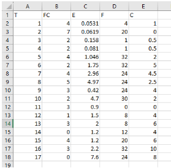

We then tried fitting the model with different types of hazard functions; IFR Salvia & Bollinger, S Distribution, Discrete Weibull (Order 2), Geometric, Negative Binomial, and Truncated Logistic each to all the possible Covariates:
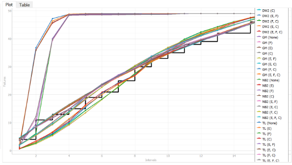

After inspecting the best fit, we determined that the Geometric and the Truncated Logistic model the failure data most accurately.
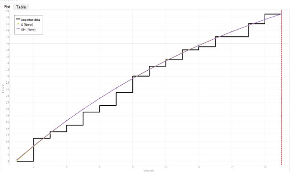

This also came clear by looking at the Model Comparison tab and sorting by median, comparing the top two models that provide the best fit for the projet. The table below shows Geometric and S Distribution model (S) having the critic (Median) value being closest to 1.
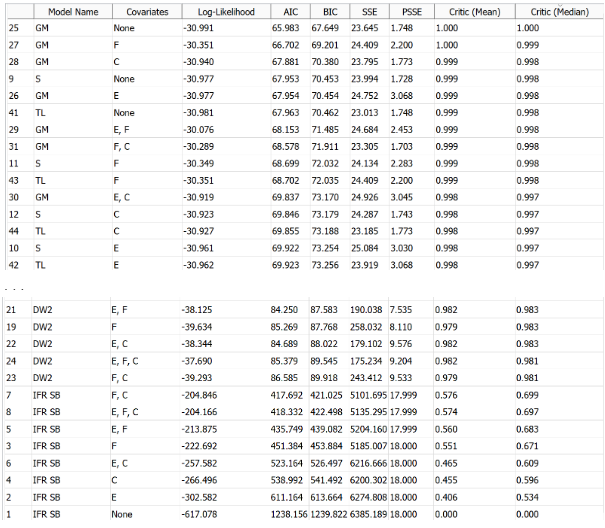

### Result of Range Analysis

It’s common to have a large amount of data collected from testing, but not all of it will be useful. By conducting range analysis we can include only the regions of failure date that are relevant to our range analysis.

One option is to use the Laplace test to find the appropriate range of data for analysis. It works by calculating the difference between the observed failure data and the expected failure data based on a particular model. Thus, we would be able to find the data points that are outside the expected range and should be excluded.

However, the C-SFRAT tool does not have the ability to conduct range analysis using Laplace or other tests. Therefore, we estimated the region that should be covered on the basis that this region was for a single version of the program. This is because when a program gets updated, there is usually a spike in failures, skewing the reliability analysis.

### Plots for the Test Data Provided
The following graphs show the Intensity graphs for the Geometric and S Distribution model (S) modeled against the E, F, C covariates. We use the covariates as they are variables in our experiments that may correlate to the failure occurrences.  

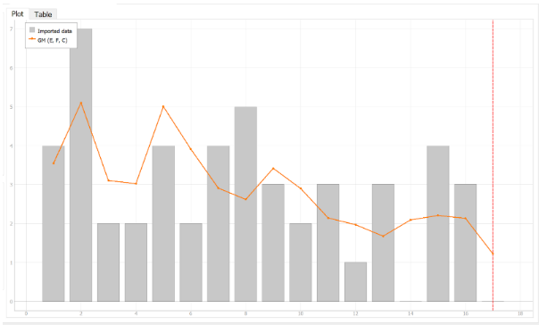

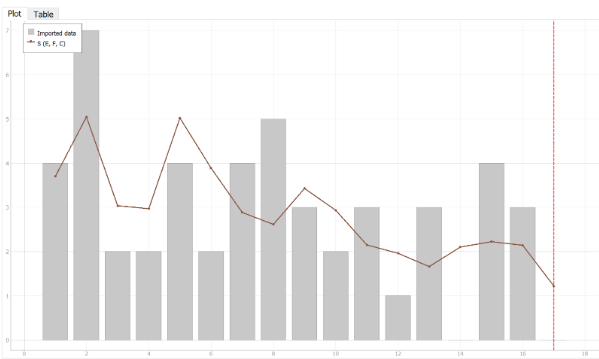

### Decision Making Given a Target Failure Rate

A particular target failure rate can guide decision making when analyzing time-between-failures, failure intensity, and reliability graphs.

For example, if the target failure rate is lower than the actual failure rate, you would require more stringent testing to address all causes for failure. The graphs can then be used to monitor progress toward the target failure rate and identify any patterns that would indicate areas for improvement.  Additionally, the graphs can use previous data to estimate the time it would take for the system’s failure rate to reach the target. The graphs will ultimately guide development and the work going into reducing the failure rate.

If the actual failure rate is already below the target failure rate, then the system can be considered reliable enough for its intended use. However, it is still wise to monitor the reliability through the aforementioned graphs and maintain the failure rate.

### Predictions

A really nice feature of C-SFRAT is being able to create predictions. This can be done by inputting a Failure Intensity Target in the input box on the left of Model Results and Predictions tab. For our purpose, we input 1, and as you can see in the figure above, C-SFRAT predicts that it will take about 22 intervals to reach our goal using the Geometric model. 

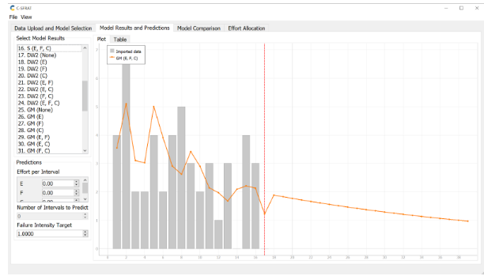

The graph below shows the same prediction without any covariates. This however, should be recognized as less accurate as we should not assume experiments without these covariates. 

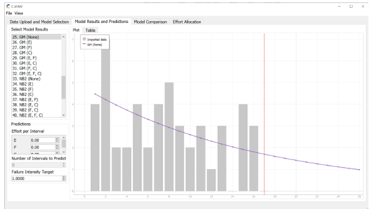

### Advantages and Disadvantages of Reliability Growth Analysis

Advantages:

- Enables early detection of design and development issues by analyzing failure data during development
- Reduction in long term costs by exposing and addressing reliability problems early in development

Disadvantages:

- Reliability Growth Analysis can be time-consuming and expensive
- Although Reliability Growth Testing can estimate future issues, it’s accuracy is limited due to relying on past data
- Limited applicability as not all systems have historical data to use for analysis

# Assessment Using Reliability Demonstration Chart 

### Plots for MTTFmin

The following failure data plots come from “Failure Report 2.docx”. Because we could not figure out how to expand the chart past 16 failures, we find the MTTFmin considering just the first 16 failures. We found MTTFmin as the lowest MTTF where the last failure point in the failure graph line is in the accept region, which is 785.

Failure data plot with minimum MTTFmin for which the SUT becomes acceptable (MTTF = 785 seconds):

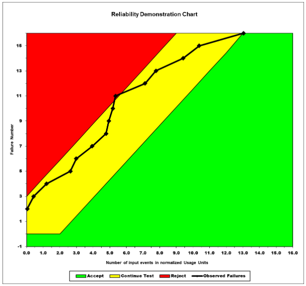

Failure data with MTTFmin halved (392.5 seconds):

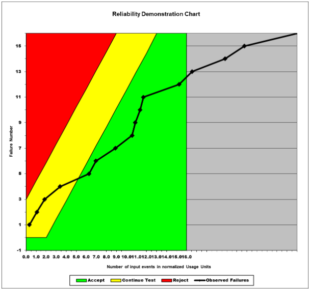

Failure data with  MTTFmin doubled (1570 seconds):

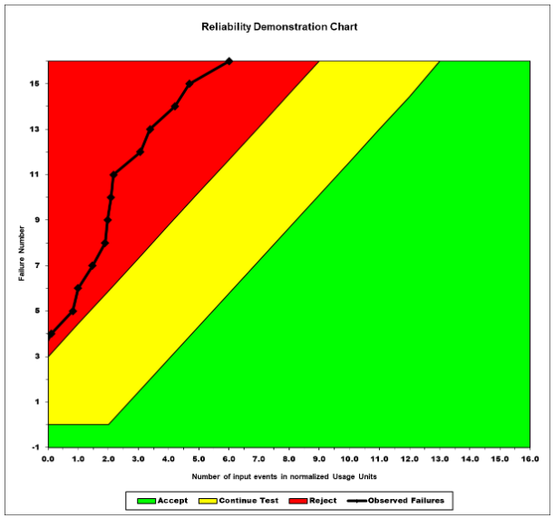

### Evaluation and Justification of chosen MTTFmin

Before we could determine the MTTFmin, we first had to determine the risk trade-off parameters, which were the supplier’s risk (α), the buyer’s risk (β), and discrimination ratio (γ). We decided to stick with the default values in RDC’s Risk Profile 1, with  α = 0.100, β = 0.100, and γ = 2.000.

Now that the accept, reject, and continue regions are set, we chose the smallest MTTF where the system can be considered acceptable (the last failure point being in the accept region). For our data set, this MTTF was 795 seconds. Refer to the first graph in the previous section, and you will see that the last failure is just barely in the accept region. If the MTTF was any higher than 795 seconds, this system would not be considered acceptable.

### Advantages and Disadvantages of RDC

RDC has many benefits:

- Versatile
- Time and cost efficient means of analyzing the reliability of a system
- Simple representation of reliability makes it easy to communicate to stakeholders

However, RDC has its limitations:

- Can’t be used to calculate how reliable the system is, only whether its acceptable or not
- Assumes that failures are independent, which may not match real-world scenarios where failures can be correlated
- Assumptions on the distribution of failure times may be inaccurate since failures happen randomly

Overall, RDC is a useful tool to demonstrate in a simple way whether a system is reliable or not, but it makes assumptions and should be used with other tools to ensure all aspects of reliability are considered.

# Comparison of Results

From the reliability growth testing done in part 1, we can see from the graphs that the system is slowly but surely becoming more reliable. The reliability demonstration chart in part 2 supports these findings by showing the failure line gradually leaning more towards the accept region as time passes. Both results agree and we can acquire more information in each part: part 1 can tell us how much longer we need to test to reach a certain target failure rate, and part 2 can tell us if we should continue testing, accept the system, or reject it.

# Discussion on Similarity and Differences of the Two Techniques

Reliability growth testing (RGT) is meant to generate and analyze time-between-failures, failure intensity and reliability graphs. Reliability demonstration charts (RDC) are meant to determine whether the SUT is acceptable or not. Both help the developer if the system’s reliability meets the requirements or not, and whether or not any further testing should be done or any adjustments made. However, the difference is that RGT can analyze rates of failure as well as predict the future reliability, whereas RDC can give a definitive yes/no as to whether the system’s reliability is acceptable or not. Both should be used for a holistic analysis of the system’s reliability.

# How the team work/effort was divided and managed

Our team was divided into halves to handle part 1 (reliability growth testing) and part 2 (reliability demonstration chart). Afterwards, we verified the other half's work worked together to compare results from each part and evaluate the similarity and differences between the two techniques. We used Discord to maintain fast and convenient communication between all group members.

# Difficulties encountered, challenges overcome, and lessons learned

We ran into great difficulty with the first part because we were not familiar with the testing tools and many of the provided files did not work with them. We learned that we should start earlier, so that we would have time to ask a TA about these problems.

# Comments/feedback on the lab itself

We feel that the lab’s instructions were insufficient and that this is the reason we struggled to complete the lab. The provided files are incompatible with the reliability tools, which forced us to convert them first. Finally, we were provided a plethora of failure data but were not told which of it we need to use. We feel that these points made the lab confusing and tedious.
